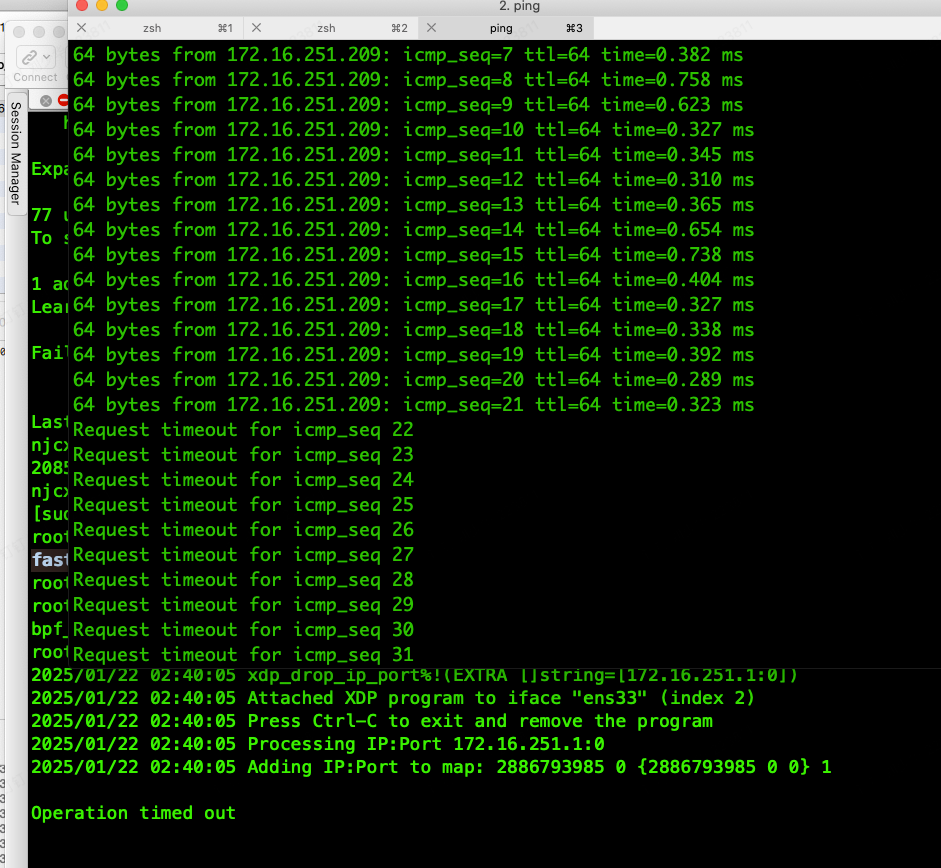

## fastdrop

利用ebpf 开发的快速丢包工具， 快速丢弃指定ip请求的包，减少协议栈的计算开销，减少cpu和网卡的负载。

loader 是使用 go +  github.com/cilium/ebpf 开发而成， 从redis list 读取 ip(source ip) + port(dest port), 

将ip + port 加入到ebpf map中，拦截指定ip到本机端口的包，不区分tcp/udp， 当port 为0时，拦截所有的包。

使用场景： 抗D 、 WAF、 网关、 CDN， 等等

ubuntu 24.04 下编译：

    apt install  clang llvm git golang make gcc-multilib -y

    make

启动方法：

    ./fastdrop  + 网卡名, 比如 ./fastdrop  ens33

redis list 数据格式：

    - 172.16.251.209:80
    - 172.16.251.201:53
    - 172.16.251.208:0

